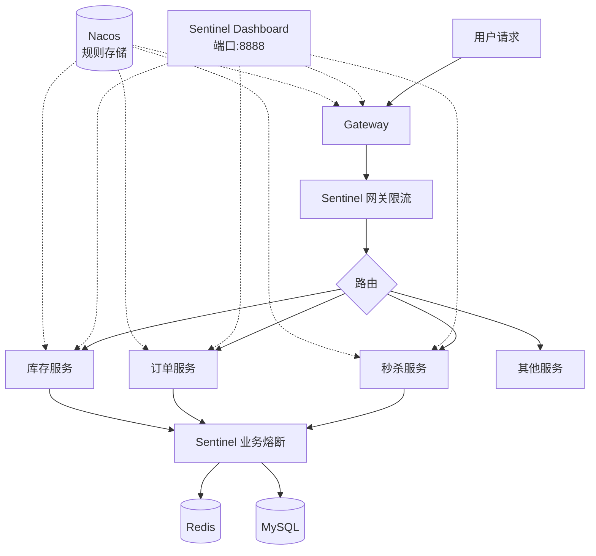
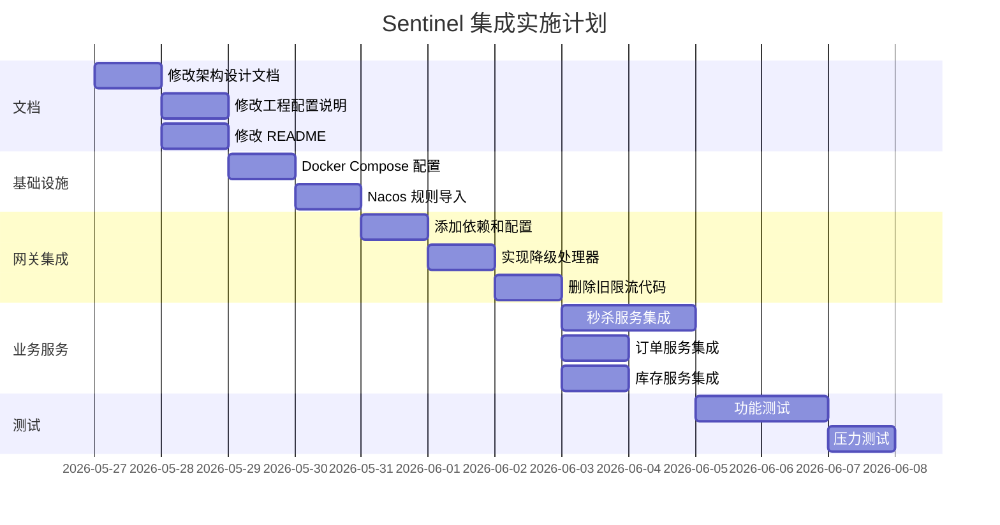

# Sentinel 熔断限流集成设计文档

## 一、文档说明

本文档描述 SnapShop 在线购物秒杀平台集成 Alibaba Sentinel 熔断限流组件的详细设计方案。Sentinel 将替代现有的 Redis 限流过滤器，为系统提供更专业的流量控制和熔断降级能力。

### 1.1 文档目标

- 明确 Sentinel 集成的架构设计和技术选型
- 定义各服务的限流、熔断规则
- 说明与现有系统的集成方式
- 列出需要修改的文档和代码

### 1.2 技术选型决策

| 决策项 | 选择 | 理由 |
|--------|------|------|
| **覆盖范围** | 网关 + 秒杀/订单/库存 | 覆盖核心高并发链路，平衡复杂度 |
| **规则存储** | Nacos | 与现有配置中心统一，规则持久化 |
| **控制台** | 需要（端口 8888） | 实时监控、动态配置规则 |
| **功能范围** | 限流 + 熔断 + 热点参数 | 满足秒杀场景多维度防护需求 |

---

## 二、架构设计

### 2.1 整体架构



### 2.2 集成层次

| 层次 | 服务 | Sentinel 功能 | 说明 |
|------|------|---------------|------|
| **接入层** | snapshop-gateway | 网关限流 | 替代现有 Redis 过滤器 |
| **业务层** | snapshop-seckill | 热点参数限流 + 熔断 | 高并发入口，多维防护 |
| **业务层** | snapshop-order | 熔断降级 | 保护数据库写操作 |
| **业务层** | snapshop-inventory | 熔断降级 | 保护库存扣减 |

### 2.3 与现有系统关系

- **替换**：移除 `RateLimitFilter.java`（Redis 限流过滤器）
- **保留**：Redis 仍用于秒杀库存预扣、缓存、幂等等业务场景
- **增强**：新增服务间调用的熔断保护机制

---

## 三、功能设计

### 3.1 网关层功能（snapshop-gateway）

| 功能 | 说明 | 配置示例 |
|------|------|----------|
| **API 路径限流** | 按路径前缀限制 QPS | `/api/seckill/**` → 1000 QPS |
| **IP 维度限流** | 按客户端 IP 限制请求频率 | 单 IP → 100 QPS |
| **统一降级响应** | 触发限流时返回标准 JSON | `{"code":429,"message":"请求过于频繁"}` |

#### 网关限流响应格式

```json
{
  "code": 429,
  "message": "请求过于频繁，请稍后重试",
  "data": null,
  "requestId": "REQ...",
  "timestamp": "2026-05-27 10:00:00"
}
```

### 3.2 秒杀服务功能（snapshop-seckill）

| 功能 | 说明 | 应用场景 |
|------|------|----------|
| **热点参数限流** | 对商品 ID 限制 QPS | 防止单个商品被恶意刷单 |
| **热点参数限流** | 对用户 ID 限制 QPS | 防止单用户过度请求 |
| **慢调用熔断** | Redis 调用超时比例过高时熔断 | 保护系统不被慢请求拖垮 |
| **异常比例熔断** | 数据库异常率超阈值时熔断 | 防止级联故障 |

#### 热点参数规则示例

```json
{
  "resource": "seckill_submit",
  "paramIdx": 0,
  "grade": 1,
  "count": 500,
  "durationInSec": 1,
  "controlBehavior": 0,
  "burstCount": 0
}
```

说明：`paramIdx: 0` 表示第一个参数（商品 ID），限制 500 QPS。

### 3.3 订单服务功能（snapshop-order）

| 功能 | 说明 | 降级策略 |
|------|------|----------|
| **异常比例熔断** | 数据库异常率超 50% 时熔断 | 返回"系统繁忙，请稍后重试" |
| **慢调用熔断** | 数据库调用超 200ms 比例过高时熔断 | 排队等待或返回失败 |

### 3.4 库存服务功能（snapshop-inventory）

| 功能 | 说明 | 降级策略 |
|------|------|----------|
| **异常比例熔断** | 库存扣减异常率超 50% 时熔断 | 返回扣减失败，触发重试 |
| **慢调用熔断** | 数据库写操作超时比例过高时熔断 | 保护数据库连接池 |

---

## 四、规则配置

### 4.1 限流规则

#### 网关限流规则

| 资源 | 阈值类型 | 阈值 | 流控效果 | 控制行为 |
|------|----------|------|----------|----------|
| `/api/seckill/**` | QPS | 1000 | 快速失败 | 直接拒绝 |
| `/api/seckill/**`（IP维度） | QPS | 100 | 快速失败 | 直接拒绝 |
| `/api/orders/**` | QPS | 500 | 快速失败 | 直接拒绝 |
| `/api/products/**` | QPS | 2000 | 快速失败 | 直接拒绝 |

#### 秒杀服务热点参数规则

| 资源 | 参数类型 | 阈值 | 说明 |
|------|----------|------|------|
| seckill_submit | 商品ID | 500 QPS | 单商品每秒最多 500 次请求 |
| seckill_submit | 用户ID | 5 QPS | 单用户每秒最多 5 次请求 |
| seckill_token | 用户ID | 2 QPS | 单用户每秒最多获取 2 次令牌 |

### 4.2 熔断规则

| 资源 | 策略 | 阈值 | 熔断时长 | 最小请求数 | 半开恢复数 |
|------|------|------|----------|------------|------------|
| seckill_redis_call | 慢调用比例 | 200ms/50% | 10s | 5 | 3 |
| seckill_db_call | 异常比例 | 50% | 10s | 5 | 3 |
| order_db_call | 异常比例 | 50% | 10s | 5 | 3 |
| inventory_db_call | 异常比例 | 50% | 10s | 5 | 3 |

### 4.3 Nacos 规则存储结构

#### 数据 ID 命名规范

```
sentinel-rules-{服务名}-{规则类型}.yaml
```

#### 示例

| 服务 | DataId | 内容 |
|------|--------|------|
| 网关 | sentinel-rules-snapshop-gateway-flow.yaml | 网关限流规则 |
| 秒杀 | sentinel-rules-snapshop-seckill-flow.yaml | 秒杀限流规则 |
| 秒杀 | sentinel-rules-snapshop-seckill-degrade.yaml | 秒杀熔断规则 |
| 订单 | sentinel-rules-snapshop-order-degrade.yaml | 订单熔断规则 |
| 库存 | sentinel-rules-snapshop-inventory-degrade.yaml | 库存熔断规则 |

#### Group

所有 Sentinel 规则统一使用 `SENTINEL_GROUP` 分组。

---

## 五、依赖与配置

### 5.1 Maven 依赖

父 POM 已包含 `spring-cloud-alibaba-dependencies`，各服务需添加：

#### 网关服务（snapshop-gateway/pom.xml）

```xml
<dependency>
    <groupId>com.alibaba.cloud</groupId>
    <artifactId>spring-cloud-starter-alibaba-sentinel</artifactId>
</dependency>
<dependency>
    <groupId>com.alibaba.cloud</groupId>
    <artifactId>spring-cloud-alibaba-sentinel-gateway</artifactId>
</dependency>
<dependency>
    <groupId>org.springframework.cloud</groupId>
    <artifactId>spring-cloud-starter-gateway</artifactId>
</dependency>
```

#### 业务服务（秒杀/订单/库存）

```xml
<dependency>
    <groupId>com.alibaba.cloud</groupId>
    <artifactId>spring-cloud-starter-alibaba-sentinel</artifactId>
</dependency>
```

### 5.2 应用配置（application.yml）

#### 网关服务配置

```yaml
spring:
  cloud:
    sentinel:
      transport:
        dashboard: localhost:8888
        port: 8719
      eager: true
      datasource:
        flow:
          nacos:
            server-addr: ${spring.cloud.nacos.server-addr}
            namespace: ${spring.cloud.nacos.config.namespace}
            dataId: sentinel-rules-snapshop-gateway-flow.yaml
            groupId: SENTINEL_GROUP
            rule-type: flow
            data-type: json
```

#### 业务服务配置模板（秒杀/订单/库存）

```yaml
spring:
  cloud:
    sentinel:
      transport:
        dashboard: localhost:8888
        port: 8719
      eager: true
      datasource:
        flow:
          nacos:
            server-addr: ${spring.cloud.nacos.server-addr}
            namespace: ${spring.cloud.nacos.config.namespace}
            dataId: sentinel-rules-${spring.application.name}-flow.yaml
            groupId: SENTINEL_GROUP
            rule-type: flow
            data-type: json
        degrade:
          nacos:
            server-addr: ${spring.cloud.nacos.server-addr}
            namespace: ${spring.cloud.nacos.config.namespace}
            dataId: sentinel-rules-${spring.application.name}-degrade.yaml
            groupId: SENTINEL_GROUP
            rule-type: degrade
            data-type: json
```

### 5.3 Docker Compose 配置

在 `docker/docker-compose.yml` 中添加：

```yaml
sentinel:
  image: bladex/sentinel-dashboard:1.8.8
  container_name: sentinel-dashboard
  ports:
    - "8888:8080"
  environment:
    - JAVA_OPT=-Dserver.port=8080 -Dcsp.sentinel.dashboard.server=localhost:8080
  healthcheck:
    test: ["CMD", "curl", "-f", "http://localhost:8080/actuator/health"]
    interval: 30s
    timeout: 10s
    retries: 3
  restart: unless-stopped
```

---

## 六、代码变更

### 6.1 需要删除的文件

| 文件 | 说明 |
|------|------|
| `snapshop-gateway/src/main/java/com/snapshop/gateway/filter/RateLimitFilter.java` | 被 Sentinel 网关限流替代 |

### 6.2 需要新增的文件

| 文件 | 说明 |
|------|------|
| `snapshop-gateway/src/main/java/com/snapshop/gateway/config/SentinelConfig.java` | Sentinel 网关配置类 |
| `snapshop-gateway/src/main/java/com/snapshop/gateway/handler/SentinelFallbackHandler.java` | 限流降级处理器 |
| `snapshop-seckill/src/main/java/com/snapshop/seckill/config/SentinelConfig.java` | 秒杀服务 Sentinel 配置 |
| `snapshop-order/src/main/java/com/snapshop/order/config/SentinelConfig.java` | 订单服务 Sentinel 配置 |
| `snapshop-inventory/src/main/java/com/snapshop/inventory/config/SentinelConfig.java` | 库存服务 Sentinel 配置 |

### 6.3 需要修改的文件

| 文件 | 修改内容 |
|------|----------|
| 各服务的 `pom.xml` | 添加 Sentinel 依赖 |
| 各服务的 `application.yml` | 添加 Sentinel 配置 |

### 6.4 Nacos 配置文件

需要在 `docker/nacos/init-config/` 目录下新增：

| 文件 | 内容 |
|------|------|
| `sentinel-rules-snapshop-gateway-flow.yaml` | 网关限流规则 |
| `sentinel-rules-snapshop-seckill-flow.yaml` | 秒杀限流规则 |
| `sentinel-rules-snapshop-seckill-degrade.yaml` | 秒杀熔断规则 |
| `sentinel-rules-snapshop-order-degrade.yaml` | 订单熔断规则 |
| `sentinel-rules-snapshop-inventory-degrade.yaml` | 库存熔断规则 |

---

## 七、文档变更

### 7.1 需要修改的文档

| 文档 | 变更内容 |
|------|----------|
| `架构设计文档.md` | 技术选型表增加 Sentinel、架构图增加 Sentinel 组件、限流设计章节重写 |
| `工程配置说明.md` | 技术版本表增加 Sentinel Dashboard、Docker Compose 规格增加 Sentinel 服务、端口表增加 8888 |
| `README.md` | 技术栈表增加 Sentinel、监控栈地址增加 Sentinel Dashboard |
| `可观测性与部署文档.md` | 增加 Sentinel 监控指标说明、Dashboard 访问说明 |

### 7.2 文档变更详情

#### 架构设计文档变更

1. **技术选型表**：增加一行
   ```
   | 流量防护 | Sentinel | 限流、熔断、热点参数防护 |
   ```

2. **架构图**：在网关和业务服务之间增加 Sentinel 组件

3. **限流设计章节**：重写为 Sentinel 方案，说明：
   - 网关层统一限流
   - 秒杀服务热点参数限流
   - 熔断降级策略

#### 工程配置说明文档变更

1. **技术版本表**：增加
   ```
   | Sentinel Dashboard | 1.8.8 | 流量防护控制台 |
   ```

2. **端口表**：增加
   ```
   | sentinel-dashboard | sentinel-dashboard | 8888 | 流量防护控制台 |
   ```

3. **Docker Compose 规格**：增加 Sentinel 服务配置

#### README.md 变更

1. **技术栈表**：增加
   ```
   | 流量防护 | Sentinel | 限流、熔断、热点参数防护 |
   ```

2. **监控栈地址**：增加
   ```
   | **Sentinel Dashboard** | http://localhost:8888 | 流量防护控制台（默认账号 sentinel/sentinel） |
   ```

---

## 八、部署与验证

### 8.1 部署步骤

1. **启动中间件**：
   ```bash
   cd docker
   docker-compose up -d
   ```

2. **导入 Nacos 配置**：
   - 将 Sentinel 规则文件导入 Nacos `snapshop-dev` 命名空间
   - Group 为 `SENTINEL_GROUP`

3. **启动后端服务**（按依赖顺序）：
   ```bash
   mvn -pl snapshop-gateway spring-boot:run
   mvn -pl snapshop-seckill spring-boot:run
   mvn -pl snapshop-order spring-boot:run
   mvn -pl snapshop-inventory spring-boot:run
   ```

4. **访问 Sentinel Dashboard**：
   - 地址：http://localhost:8888
   - 默认账号：sentinel/sentinel

### 8.2 验证方法

1. **限流验证**：
   - 使用 JMeter 压测秒杀接口
   - 观察 Sentinel Dashboard 实时监控
   - 确认超过阈值时返回 429

2. **熔断验证**：
   - 模拟数据库异常（如关闭数据库）
   - 观察熔断状态变化
   - 确认降级响应正常

3. **热点参数验证**：
   - 对同一商品 ID 高频请求
   - 确认触发热点参数限流

---

## 九、风险与注意事项

### 9.1 端口冲突

- Sentinel Dashboard 默认端口 8080 与网关冲突
- **解决方案**：Dashboard 使用 8888 端口

### 9.2 规则同步延迟

- Nacos 配置变更到 Sentinel 生效有短暂延迟（秒级）
- **影响**：规则更新不是实时生效
- **缓解**：生产环境建议结合 Sentinel Dashboard 动态推送

### 9.3 性能影响

- Sentinel 本身有轻微性能开销（微秒级）
- **影响**：对高并发场景影响可忽略
- **监控**：观察 P99 延迟变化

### 9.4 兼容性

- Spring Cloud Alibaba 2023.0.1.0 兼容 Sentinel 1.8.x
- **确认**：使用 Sentinel Dashboard 1.8.8 版本

---

## 十、实施计划

### 10.1 实施顺序

1. **阶段一**：文档更新
   - 修改架构设计文档
   - 修改工程配置说明
   - 修改 README
   - 创建 Sentinel 集成设计文档（本文档）

2. **阶段二**：基础设施
   - Docker Compose 添加 Sentinel Dashboard
   - Nacos 导入 Sentinel 规则配置

3. **阶段三**：网关集成
   - 添加 Sentinel 依赖
   - 配置网关限流规则
   - 实现降级处理器
   - 删除 RateLimitFilter

4. **阶段四**：业务服务集成
   - 秒杀服务集成热点参数限流和熔断
   - 订单服务集成熔断降级
   - 库存服务集成熔断降级

5. **阶段五**：测试验证
   - 限流功能测试
   - 熔断功能测试
   - 热点参数测试
   - 压力测试

### 10.2 依赖关系



---

## 十一、相关文档

- [架构设计文档](../架构设计文档.md)
- [工程配置说明](../工程配置说明.md)
- [可观测性与部署文档](../可观测性与部署文档.md)
- [README](../../README.md)

---

## 十二、修订记录

| 版本 | 日期 | 修订内容 | 作者 |
|------|------|----------|------|
| 1.0 | 2026-05-27 | 初始版本 | OpenCode |
