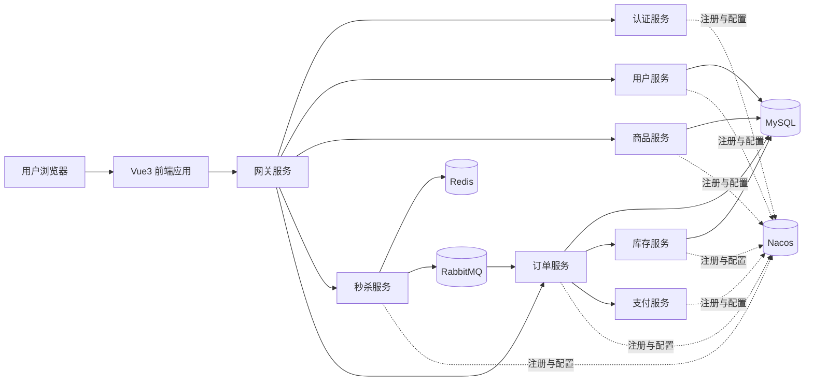
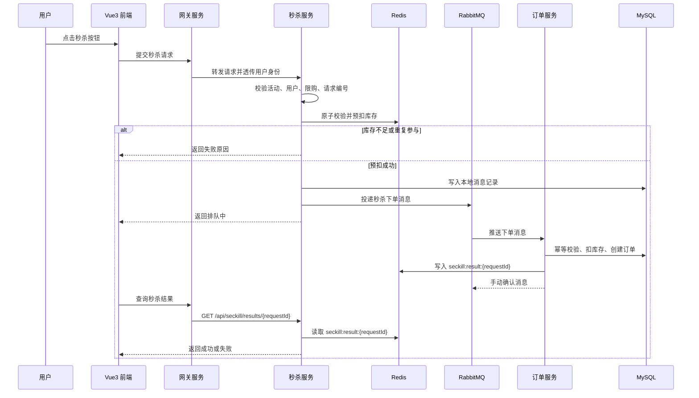

# SnapShop 在线购物秒杀平台架构设计文档

## 一、文档说明

本文档用于说明 SnapShop 在线购物秒杀平台的整体架构设计、服务拆分、核心业务链路、中间件使用方式以及可靠性方案。项目仓库地址为：[Tangyd893/SnapShop](https://github.com/Tangyd893/SnapShop.git)。

SnapShop 是一个面向高并发秒杀场景的在线购物平台。平台核心目标是让用户能够浏览商品、参与秒杀活动、异步下单、查询订单状态，并在高并发情况下保证库存不超卖、订单不重复、消息不丢失。

## 二、建设目标

### 2.1 业务目标

- 支持用户注册、登录、浏览商品、查看商品详情。
- 支持秒杀活动列表、秒杀商品详情、活动倒计时、活动状态展示。
- 支持用户提交秒杀请求，平台异步处理下单。
- 支持用户查询秒杀结果和订单详情。
- 支持订单支付、订单取消、订单超时关闭等基础电商流程。

### 2.2 技术目标

- 使用 Java 和 Spring Cloud Alibaba 构建后端微服务。
- 使用 Nacos 进行服务注册发现和配置管理。
- 使用 OpenFeign 完成后端服务间声明式调用。
- 使用 RabbitMQ 承接秒杀请求削峰、异步下单和事件通知。
- 使用 Docker 管理本地开发中间件，降低环境搭建成本。
- 使用 Vue3 构建前端应用，提供秒杀活动和购物流程页面。

### 2.3 可靠性目标

- 防止 RabbitMQ 消息重复投递导致重复创建订单。
- 防止生产端、队列端、消费端出现消息丢失。
- 防止高并发秒杀导致库存超卖。
- 防止用户重复点击或恶意重放请求造成重复下单。
- 支持失败重试、死信处理、补偿任务和库存对账。

## 三、项目目录规划

项目根目录规划为五个核心目录，并在根目录维护 `README.md`。

```text
SnapShop/
├── backend/                 # 后端微服务工程
├── frontend/                # Vue3 前端工程
├── docker/                  # 中间件编排与配置
├── docs/                    # 项目设计文档
├── testing/                 # 接口测试、压测脚本、测试数据
└── README.md                # 项目介绍、启动方式、目录索引
```

建议的后端目录结构如下：

```text
backend/
├── snapshop-gateway/        # 网关服务
├── snapshop-common/         # 公共模块
├── snapshop-auth/           # 认证服务
├── snapshop-user/           # 用户服务
├── snapshop-product/        # 商品服务
├── snapshop-seckill/        # 秒杀服务
├── snapshop-order/          # 订单服务
├── snapshop-inventory/      # 库存服务
└── snapshop-payment/        # 支付服务或模拟支付服务
```

建议的前端目录结构如下：

```text
frontend/
└── snapshop-web/
    ├── src/
    │   ├── api/             # 请求封装
    │   ├── assets/          # 静态资源
    │   ├── components/      # 公共组件
    │   ├── router/          # 路由配置
    │   ├── stores/          # 状态管理
    │   ├── views/           # 页面视图
    │   ├── utils/           # 工具方法
    │   └── main.ts          # 应用入口
    ├── package.json
    └── vite.config.ts
```

建议的 Docker 目录结构如下：

```text
docker/
├── docker-compose.yml       # 本地中间件统一启动文件
├── nacos/                   # Nacos 配置
├── rabbitmq/                # RabbitMQ 配置
├── mysql/                   # MySQL 初始化脚本
└── redis/                   # Redis 配置
```

建议的测试目录结构如下：

```text
testing/
├── api/                     # 接口测试集合
├── load/                    # 秒杀压测脚本
└── data/                    # 初始化数据和测试数据
```

## 四、技术选型

| 类型 | 技术 | 作用 |
| --- | --- | --- |
| 前端框架 | Vue3 | 构建秒杀活动页、商品页、订单页 |
| 前端构建工具 | Vite | 本地开发和前端打包 |
| 前端路由 | Vue Router | 页面路由管理 |
| 前端状态管理 | Pinia | 登录态、用户信息、购物状态管理 |
| 请求库 | Axios | 调用后端接口 |
| 后端语言 | Java | 后端服务开发语言 |
| 后端框架 | Spring Boot | 微服务基础应用框架 |
| 微服务框架 | Spring Cloud Alibaba | 注册发现、配置、网关、服务调用体系 |
| 注册配置中心 | Nacos | 服务注册、发现和配置管理 |
| 服务间调用 | OpenFeign | 声明式远程调用 |
| 消息队列 | RabbitMQ | 秒杀削峰、异步下单、订单事件通知 |
| 缓存 | Redis | 热点数据缓存、秒杀库存、幂等标记、限流 |
| 数据库 | MySQL | 用户、商品、库存、订单、消息日志持久化 |
| 容器管理 | Docker、Docker Compose | 管理本地中间件环境 |
| 测试工具 | JUnit、Spring Boot Test、JMeter 或 Gatling | 单元测试、集成测试、压测 |

## 五、总体架构

平台采用前后端分离和微服务架构。Vue3 前端通过网关访问后端接口，网关将请求路由到各业务服务。业务服务注册到 Nacos，通过 OpenFeign 完成同步调用，通过 RabbitMQ 完成异步消息处理。



### 5.1 架构分层

- 表现层：Vue3 前端应用，负责页面展示、用户交互、状态提示、接口调用。
- 接入层：网关服务，负责统一入口、路由转发、鉴权、限流、跨域和请求追踪。
- 业务层：认证、用户、商品、秒杀、订单、库存、支付等业务服务。
- 消息层：RabbitMQ，负责秒杀下单消息、订单事件和补偿事件传递。
- 数据层：MySQL 保存核心业务数据，Redis 保存热点数据和高频状态。
- 基础设施层：Nacos、Docker、日志监控、测试脚本。

### 5.2 核心调用关系

- 前端只访问网关，不直接访问具体业务服务。
- 网关根据路径路由到不同服务。
- 秒杀提交接口只做快速校验、库存预扣和消息投递，不直接创建订单。
- 订单服务消费 RabbitMQ 消息后再创建订单。
- 库存服务作为数据库库存的最终扣减入口。
- 支付服务负责支付成功、支付失败、订单关闭等事件流转。

## 六、核心服务设计

### 6.1 网关服务

网关服务是后端对外统一入口，主要职责如下：

- 路由前端请求到对应业务服务。
- 校验登录令牌并解析用户身份。
- 对秒杀提交接口进行基础限流。
- 生成并透传请求编号，方便日志追踪。
- 统一处理跨域、请求日志、异常响应。

建议网关路由规则：

| 路径前缀 | 目标服务 |
| --- | --- |
| `/api/auth/**` | 认证服务 |
| `/api/users/**` | 用户服务 |
| `/api/products/**` | 商品服务 |
| `/api/seckill/**` | 秒杀服务 |
| `/api/orders/**` | 订单服务 |
| `/api/payments/**` | 支付服务 |

### 6.2 认证服务

认证服务负责用户登录和令牌管理：

- 用户注册。
- 用户登录。
- 用户退出。
- 登录令牌签发和刷新。
- 用户身份校验。
- 向网关或其他服务提供用户基础身份能力。

### 6.3 用户服务

用户服务负责用户资料和收货信息：

- 查询当前用户资料。
- 修改用户昵称、头像、手机号等基础信息。
- 管理收货地址。
- 查询用户状态，判断是否允许参与秒杀。

### 6.4 商品服务

商品服务负责商品展示相关能力：

- 商品列表。
- 商品详情。
- 商品规格和库存展示。
- 商品上下架状态。
- 秒杀商品基础信息查询。
- 热门商品缓存预热。

商品读请求多、写请求少，适合将商品详情、秒杀商品信息缓存到 Redis。

### 6.5 秒杀服务

秒杀服务是整个平台的高并发入口，职责如下：

- 管理秒杀活动信息。
- 校验活动是否开始、是否结束、是否可参与。
- 校验用户是否重复参与。
- 校验商品是否仍有秒杀库存。
- 签发短期有效的秒杀令牌（提交秒杀前必填）。
- 通过 Redis 原子操作完成库存预扣。
- 生成下单消息并投递到 RabbitMQ。
- 记录本地消息表，支持消息补偿重投。
- **对外提供秒杀结果查询**（`GET /api/seckill/results/{requestId}`）：优先读 Redis `seckill:result:{requestId}`，未命中时回查订单状态。

秒杀服务不直接写订单表，避免在高并发入口产生长事务和数据库压力。

### 6.6 订单服务

订单服务负责消费秒杀下单消息并创建订单：

- 消费 RabbitMQ 秒杀下单消息。
- 根据消息编号和业务键进行幂等校验。
- 创建订单、订单明细和订单状态流水。
- **写入秒杀结果到 Redis**（`seckill:result:{requestId}`），供秒杀服务查询接口使用。
- 查询订单列表、订单详情。
- 处理订单取消、订单关闭、支付成功等状态变化。
- 记录消息消费日志，防止重复消费。

### 6.7 库存服务

库存服务负责维护数据库真实库存：

- 查询商品库存。
- 条件扣减库存。
- 锁定库存。
- 支付成功后确认销量。
- 订单取消或超时后回补库存。
- 记录库存流水，便于排查和对账。

### 6.8 支付服务

支付服务在项目初期可以先实现模拟支付：

- 创建支付单。
- 模拟支付成功。
- 模拟支付失败。
- 发布支付结果事件。
- 通知订单服务更新订单状态。

后续可替换为第三方支付接入。

## 七、秒杀核心业务流程

### 7.1 秒杀前准备

秒杀开始前由后台或定时任务完成活动预热：

1. 校验秒杀活动配置是否完整。
2. 查询活动商品、价格、限购数量和活动库存。
3. 将活动商品信息写入 Redis。
4. 将活动库存写入 Redis。
5. 初始化用户购买标记集合。
6. 启动活动状态或等待活动开始。

Redis 键建议如下：

```text
秒杀活动信息：seckill:activity:{活动编号}
秒杀商品信息：seckill:item:{活动编号}:{商品规格编号}
秒杀库存：seckill:stock:{活动编号}:{商品规格编号}
用户购买标记：seckill:user:{活动编号}:{商品规格编号}:{用户编号}
秒杀结果：seckill:result:{请求编号}
```

### 7.2 秒杀提交流程



### 7.3 秒杀结果状态

秒杀提交后不立即返回订单编号，而是返回请求编号和排队状态。前端根据请求编号查询处理结果。

| 状态 | 含义 | 前端表现 |
| --- | --- | --- |
| `排队中` | 请求已进入异步处理流程 | 按钮禁用，展示处理中 |
| `成功` | 订单创建成功 | 跳转订单详情或展示支付入口 |
| `失败` | 订单创建失败 | 展示失败原因 |
| `售罄` | 活动库存不足 | 按钮置灰 |
| `重复参与` | 用户已参与过该活动商品 | 展示已抢购提示 |
| `活动未开始` | 当前时间早于活动开始时间 | 展示倒计时 |
| `活动已结束` | 当前时间晚于活动结束时间 | 展示活动结束 |

## 八、防止重复消费设计

RabbitMQ 默认更适合“至少一次投递”模型。只要存在网络抖动、消费者宕机、确认消息丢失、业务处理超时，就可能发生重复投递。因此订单服务必须把“重复消费是正常情况”作为设计前提。

### 8.1 消息唯一编号

秒杀服务生成消息时必须携带全局唯一消息编号，建议格式：

```text
秒杀消息:{活动编号}:{商品规格编号}:{用户编号}:{请求编号}
```

消息编号必须贯穿：

- 本地消息表。
- RabbitMQ 消息头。
- RabbitMQ 消息体。
- 订单服务消费日志。
- 业务日志。

### 8.2 业务幂等键

除消息编号外，还需要业务幂等键，建议格式：

```text
用户编号:活动编号:商品规格编号
```

业务含义是：同一用户在同一活动中对同一商品规格只能成功下单一次。

### 8.3 数据库唯一约束

数据库必须增加唯一约束作为最后防线：

```sql
ALTER TABLE seckill_order
ADD UNIQUE KEY uk_user_activity_sku (user_id, activity_id, sku_id);
```

即使 Redis 标记失效、消息重复投递或服务重试，数据库仍能阻止重复订单落库。

### 8.4 消费日志表

订单服务增加消息消费日志表：

```text
消息编号
业务幂等键
消费状态
重试次数
错误信息
创建时间
更新时间
```

消费状态建议：

| 状态 | 含义 |
| --- | --- |
| `处理中` | 消费者已收到消息，业务正在处理 |
| `成功` | 业务处理完成，消息可以确认 |
| `失败` | 当前处理失败，可等待重试或补偿 |
| `死信` | 多次处理失败，已进入人工或补偿流程 |

### 8.5 消费事务边界

消费者处理消息时必须保证业务操作和消费记录在同一个数据库事务中完成。

```text
开启事务
  查询消息消费记录
  如果已成功，直接结束业务处理
  插入或更新消费记录为处理中
  校验业务幂等键
  条件扣减数据库库存
  创建订单
  创建订单明细
  写入订单状态流水
  更新消费记录为成功
提交事务
手动确认 RabbitMQ 消息
```

如果事务失败，不确认 RabbitMQ 消息，由 RabbitMQ 重新投递或进入死信队列。

## 九、防止信息丢失设计

信息丢失包括四类典型情况：

- 秒杀服务业务处理成功，但消息没有成功发送到 RabbitMQ。
- 消息进入 RabbitMQ 后，因为队列或消息未持久化而丢失。
- 订单服务处理业务成功，但确认消息失败，引发重复投递。
- 订单服务处理业务失败，但异常没有被记录，后续无法补偿。

### 9.1 生产端可靠投递

秒杀服务需要开启 RabbitMQ 生产端确认机制：

- 开启发布确认，确认消息到达交换机。
- 开启退回通知，发现无法路由到队列的消息。
- 发送消息时设置消息持久化。
- 投递时设置强制路由，避免路由失败时静默丢失。

### 9.2 本地消息表

秒杀服务写入本地消息表，用于记录消息发送状态。

```text
本地消息表
├── 消息编号
├── 交换机
├── 路由键
├── 消息内容
├── 消息状态
├── 重试次数
├── 下次重试时间
├── 创建时间
└── 更新时间
```

推荐流程：

1. 秒杀服务完成 Redis 库存预扣。
2. 写入本地消息表，状态为待发送。
3. 向 RabbitMQ 投递消息。
4. 收到发布确认后，将状态改为已发送。
5. 如果发送失败或长时间未确认，定时任务扫描并重投。

### 9.3 队列持久化

RabbitMQ 侧需要保证：

- 交换机持久化。
- 队列持久化。
- 消息持久化。
- 关键队列可以使用仲裁队列提升可靠性。
- 配置死信交换机和死信队列承接异常消息。

### 9.4 消费端手动确认

订单服务必须使用手动确认：

- 业务事务提交成功后确认消息。
- 可恢复异常时拒绝消息并允许重试。
- 不可恢复异常时投递死信队列。
- 已经成功处理过的重复消息应直接确认。

### 9.5 补偿和对账

系统需要提供定时补偿任务：

- 扫描长时间未发送成功的本地消息。
- 扫描长时间处于处理中的消费记录。
- 对比 Redis 秒杀库存、MySQL 库存和订单数量。
- 处理订单超时未支付后的库存回补。
- 对死信队列消息进行告警和人工处理。

## 十、库存一致性设计

秒杀库存分为 Redis 预扣库存和 MySQL 真实库存。

### 10.1 Redis 库存

Redis 用于秒杀入口的高并发库存判断。秒杀请求进入后，通过 Lua 脚本一次性完成：

- 判断活动库存是否存在。
- 判断用户是否已经参与。
- 判断库存是否大于零。
- 扣减库存。
- 写入用户参与标记。

Lua 脚本可以保证这些操作在 Redis 内部原子执行。

### 10.2 MySQL 库存

MySQL 是库存最终一致性的落点。订单服务创建订单时调用库存服务进行条件扣减：

```sql
UPDATE sku_stock
SET available_stock = available_stock - 1,
    locked_stock = locked_stock + 1,
    version = version + 1
WHERE sku_id = ?
  AND available_stock > 0
  AND version = ?;
```

如果影响行数为零，表示数据库库存不足或版本冲突，订单创建失败，并触发 Redis 库存补偿。

### 10.3 库存回补

以下场景必须回补库存：

- 秒杀消息最终进入死信队列且订单未创建。
- 数据库库存扣减失败。
- 订单超时未支付。
- 用户取消订单。
- 支付失败。

库存回补需要记录库存流水，避免重复回补。

## 十一、前端架构设计

前端使用 Vue3，建议使用 Vite 创建工程。

### 11.1 前端页面

| 页面 | 说明 |
| --- | --- |
| 首页 | 展示商品入口、秒杀活动入口 |
| 商品列表页 | 展示普通商品列表 |
| 商品详情页 | 展示商品详情、价格、库存、购买入口 |
| 秒杀活动页 | 展示活动列表、活动状态、倒计时 |
| 秒杀详情页 | 展示秒杀商品、秒杀价格、按钮状态 |
| 秒杀结果页 | 展示排队中、成功、失败、售罄等状态 |
| 订单列表页 | 展示用户订单 |
| 订单详情页 | 展示订单明细、支付状态、取消入口 |
| 登录页 | 用户登录 |

### 11.2 前端状态管理

Pinia 建议拆分为：

- 用户状态：令牌、用户资料、登录状态。
- 商品状态：商品列表筛选条件、商品详情缓存。
- 秒杀状态：活动状态、倒计时、提交状态、请求编号、**秒杀结果轮询状态**（调用 `/api/seckill/results`）。
- 订单状态：订单列表、订单详情。

### 11.3 秒杀按钮状态

秒杀按钮状态建议如下：

| 状态 | 按钮表现 |
| --- | --- |
| 未登录 | 显示去登录 |
| 活动未开始 | 显示倒计时并禁用 |
| 可抢购 | 显示立即抢购 |
| 提交中 | 显示提交中并禁用 |
| 排队中 | 显示排队中并禁用 |
| 抢购成功 | 显示查看订单 |
| 抢购失败 | 显示失败原因 |
| 已售罄 | 显示已售罄并禁用 |

## 十二、数据模型概览

建议核心表如下：

| 表名 | 说明 |
| --- | --- |
| `user` | 用户信息 |
| `user_address` | 用户收货地址 |
| `product` | 商品主表 |
| `sku` | 商品规格表 |
| `sku_stock` | 商品库存表 |
| `seckill_activity` | 秒杀活动表 |
| `seckill_activity_item` | 秒杀活动商品表 |
| `order` | 订单主表 |
| `order_item` | 订单明细表 |
| `order_status_log` | 订单状态流水表 |
| `inventory_log` | 库存流水表 |
| `local_message` | 生产端本地消息表 |
| `mq_message_log` | 消费端消息日志表 |

关键唯一约束：

```sql
ALTER TABLE `order`
ADD UNIQUE KEY uk_order_no (order_no);

ALTER TABLE `seckill_order`
ADD UNIQUE KEY uk_user_activity_sku (user_id, activity_id, sku_id);

ALTER TABLE `local_message`
ADD UNIQUE KEY uk_message_id (message_id);

ALTER TABLE `mq_message_log`
ADD UNIQUE KEY uk_message_id (message_id);
```

## 十三、中间件部署规划

本地开发阶段使用 Docker Compose 启动中间件。版本、端口、Nacos dataId、环境变量等**以 [工程配置说明.md](工程配置说明.md) 为准**。

| 中间件 | 默认端口 | 用途 |
| --- | --- | --- |
| Nacos | `8848` | 服务注册发现、配置管理 |
| RabbitMQ | `5672`、`15672` | 消息队列、管理控制台 |
| MySQL | `3306` | 业务数据持久化 |
| Redis | `6379` | 缓存、库存、幂等、限流 |

建议启动顺序：

1. 启动 Docker 中间件。
2. 初始化 MySQL 表结构和测试数据。
3. 导入 Nacos 配置。
4. 启动后端微服务。
5. 启动 Vue3 前端应用。
6. 执行接口测试和秒杀压测。

## 十四、可观测性设计

建议统一记录以下字段：

- 请求编号。
- 链路编号。
- 消息编号。
- 用户编号。
- 活动编号。
- 商品规格编号。
- 订单编号。
- 服务名称。
- 错误码。
- 错误原因。

建议监控指标：

- 秒杀接口请求量。
- 秒杀成功率和失败率。
- RabbitMQ 消息堆积数量。
- RabbitMQ 死信数量。
- 消息重试次数。
- Redis 库存数量。
- MySQL 库存数量。
- 订单创建耗时。
- 数据库慢查询。

## 十五、安全与限流设计

秒杀接口需要加强防护：

- 用户必须登录后才能参与秒杀。
- 网关按用户编号和网络地址限流。
- 同一用户同一活动商品只能成功下单一次。
- 秒杀提交必须携带短期有效的秒杀令牌（由 `POST /api/seckill/.../token` 签发），避免提前刷接口。
- 高频失败请求进入风控名单（规则见下表）。
- 完整增强版可选：请求携带 `X-Timestamp` 与 `X-Sign`（HMAC-SHA256，密钥存 Nacos `snapshop.seckill.sign-secret`）；时钟偏移容忍 ±300 秒。
- 高风险活动可开启验证码（管理后台配置，P2）。

**风控名单（已锁定）**：

| 触发条件 | 动作 |
| --- | --- |
| 同一用户 1 分钟内秒杀失败 ≥ 20 次 | `allowSeckill=false`，持续 30 分钟 |
| 同一 IP 1 分钟内秒杀请求 ≥ 100 次 | 网关限流 429 |
| 解除 | 超时自动解除或管理员在后台手动解除 |

用户服务 `GET /internal/users/{userId}/status` 返回的 `allowSeckill` 由上述规则与账号状态（`DISABLED`）共同决定。

## 十六、架构结论

SnapShop 的核心架构是：Vue3 前端负责用户交互，网关负责统一接入，Spring Cloud Alibaba 微服务负责业务能力，Nacos 负责注册与配置，OpenFeign 负责服务间调用，RabbitMQ 负责异步削峰，Redis 负责高并发库存与缓存，MySQL 负责核心数据持久化。

秒杀平台的可靠性需要通过多层机制共同保证：生产端本地消息表、RabbitMQ 持久化、发布确认、消费端手动确认、消费幂等、数据库唯一约束、库存补偿和定时对账。只有形成完整闭环，才能在重复投递、服务重启、网络抖动和部分失败场景下保证订单和库存最终一致。
